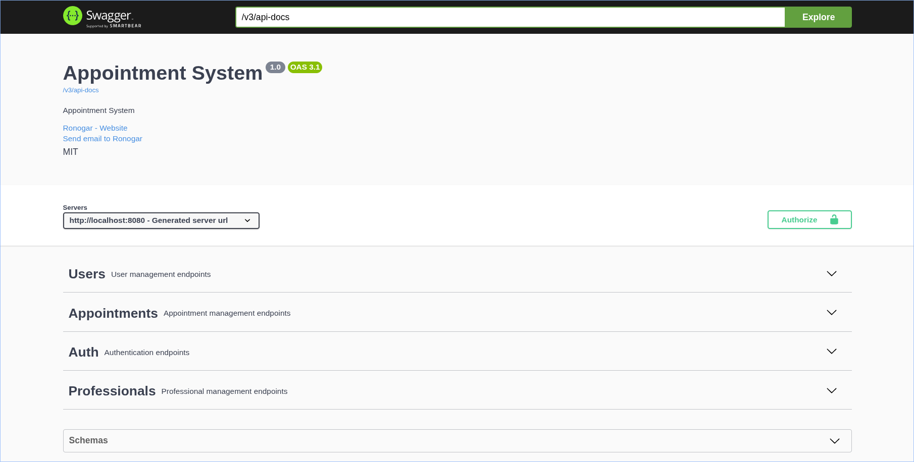
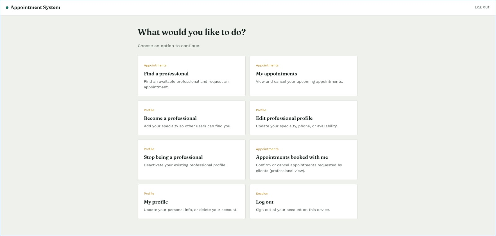

# Appointment System API

[](https://github.com/Rong-ARG/appointment-system/actions/workflows/ci.yml)


A REST API for scheduling appointments between clients and professionals.
Built as a personal project to practice Java and Spring Boot while preparing
for my first job as a backend developer :)

## Key results

- **149 automated tests** (JUnit 5, Mockito and MockMvc), with CI on GitHub Actions
- **13 bugs and security issues** found and fixed during development ([see the list](#bugs-and-security-fixes))
- **26 REST endpoints** across auth, users, professionals and appointments
- **JWT authentication** with ownership checks, so users can only access their own data

## Features

- JWT authentication with Spring Security and two roles (USER and ADMIN)
- One account can be both a client and a professional
- Clients can search professionals by specialty or last name and book appointments
- Professionals can confirm or cancel the appointments booked with them
- Ownership checks: you can only see or modify appointments you're involved in
- Business rules: a user or professional can't be deleted while they still have appointments
- Validation and error handling that return clear JSON messages
- Swagger documentation and a test suite with JUnit 5 and Mockito

## Design decisions

- **One DTO per operation** (Request, Response, Patch), so the API contract doesn't expose entity internals
- **Shared `Account` model:** a person can be both a client and a professional without duplicating credentials
- **Ownership checks in the service layer**, not only in the controllers
- **Status transitions defined in the `AppointmentStatus` enum**, so the rules live next to the states

## Technologies

- Java 21
- Spring Boot 4.1.0
- Spring Data JPA
- MySQL 8
- Docker
- Lombok
- Jakarta Validation
- springdoc-openapi 2.8.9
- Spring Security + JWT (auth0/java-jwt)
- JUnit 5 + Mockito

## Notes

- Spring Boot version was set to 4.1.0 to ensure compatibility with springdoc-openapi 2.8.9
- `application.properties` is not committed (it's in `.gitignore`), use `application.properties.example` as a starting point
- The JWT key in the example file is just a demo value so the project runs out of the box. In a real app it should never be hardcoded, it would come from an environment variable instead.

## API Documentation

Swagger UI available at: http://localhost:8080/swagger-ui/index.html



## Getting Started

### Prerequisites

- Java 21
- Docker

### Setup

1. Clone the repository
   ```
   git clone https://github.com/Rong-ARG/appointment-system.git
   cd appointment-system
   ```
2. Copy the example properties file
   ```
   cp src/main/resources/application.properties.example src/main/resources/application.properties
   ```
3. Start the database
   ```
   docker compose up -d
   ```
4. Run the application
   ```
   ./mvnw spring-boot:run
   ```
5. Access Swagger UI at http://localhost:8080/swagger-ui/index.html
6. A small test frontend (plain HTML/CSS/JS) is included under `src/main/resources/static`. Once the app is running, open http://localhost:8080/login.html to try the full login flow. There's also a `profile.html` page to edit your info or delete your account, and a `professional-appointments.html` page for professionals to confirm/cancel appointments booked with them.

This is what the test frontend looks like once you log in:



### Running the tests

```
./mvnw test
```

Do the setup steps above first (properties file + database running), because `AppointmentSystemApplicationTests` loads the full Spring context. The rest of the tests use mocks and don't need the database.

## API Endpoints

### Auth

| Method | Endpoint | Description |
|--------|----------|-------------|
| POST | /auth/login | Log in with email and password, returns a JWT |

### Users

| Method | Endpoint | Description |
|--------|----------|-------------|
| GET | /api/users | Get all users |
| GET | /api/users/{id} | Get user by ID |
| GET | /api/users/email/{email} | Get user by email |
| GET | /api/users/lastname/{lastName} | Get users by last name |
| POST | /api/users | Create user |
| PUT | /api/users/{id} | Update user |
| PATCH | /api/users/{id} | Partially update user |
| DELETE | /api/users/{id} | Delete user |

### Professionals

| Method | Endpoint | Description |
|--------|----------|-------------|
| GET | /api/professionals | Get all professionals |
| GET | /api/professionals/{id} | Get professional by ID |
| GET | /api/professionals/email/{email} | Get professional by email |
| GET | /api/professionals/lastname/{lastName} | Get professionals by last name |
| GET | /api/professionals/specialty/{specialty} | Get professionals by specialty |
| POST | /api/professionals | Create professional (ADMIN only) |
| POST | /api/professionals/me | Become a professional yourself (self-service, requires an existing user account) |
| PUT | /api/professionals/{id} | Update professional |
| PATCH | /api/professionals/{id} | Partially update professional |
| DELETE | /api/professionals/{id} | Delete professional |

### Appointments

| Method | Endpoint | Description |
|--------|----------|-------------|
| GET | /api/appointments | Get all appointments |
| GET | /api/appointments/{id} | Get appointment by ID |
| GET | /api/appointments/mine | Get the logged-in user's own appointments |
| GET | /api/appointments/mineProf | Get appointments booked with the logged-in professional |
| POST | /api/appointments | Create appointment |
| PATCH | /api/appointments/{id} | Update appointment status |
| DELETE | /api/appointments/{id} | Delete appointment |

## Roadmap

- [x] Exception handling
- [x] Swagger / OpenAPI documentation
- [x] Spring Security + JWT
- [x] Shared Account/roles model (a person can be both a user and a professional)
- [ ] Flyway migrations
- [x] Unit testing — UserServiceImpl, ProfessionalServiceImpl, AppointmentServiceImpl fully covered (68 tests)
- [x] Unit testing — AuthService / JwtService fully covered (6 tests)
- [x] Unit testing — CurrentUserService
- [x] Controller tests (MockMvc) — Auth, User, Professional and Appointment controllers (149 tests in total across the project)

## Bugs and security fixes

Things I found and fixed while building the project:

<details>
<summary>Show the 13 fixes</summary>

- Users could create appointments on behalf of other users — `userId` in the request body wasn't checked against the logged-in user.
- A `Professional` could be created without an existing `User` account — broke the "user first, professional later" model.
- Anyone could turn someone else's account into a professional — `POST /api/professionals` is now ADMIN-only, self-service is done through `/me`.
- `GET /api/appointments/{id}` (and delete/patch) didn't check if the logged-in user was actually involved in the appointment — added an ownership check (`verifyOwner`) shared across those methods.
- Confusing error message when a professional-only account hits an endpoint that expects a user profile — now says clearly that the account has no user profile.
- A professional could delete their account while still having pending appointments, leaving them orphaned — `deleteProfessional` now blocks the deletion if the professional still has appointments.
- `deleteUser` still left a `Professional` profile orphaned (no `User`) if that account also had a professional profile — `deleteUser` now blocks the deletion if the account still has a professional profile (must delete that first) or if the user has pending appointments as a client.
- Backend error messages weren't showing up on the frontend (always showed a generic "Error 409" instead of the real message) — exception handlers in `GlobalExceptionHandler` were returning plain text instead of JSON, but the frontend's `apiFetch` only parses the response body when the `Content-Type` is `application/json`. Now every handler returns `{ "message": "..." }`.
- Removing a professional profile could throw a raw Hibernate error (`ObjectDeletedException`) straight to the user — `Account` still held an in-memory reference to the already-deleted `Professional` (cascade tried to re-save it). Fixed by clearing the reference (`account.setProfessional(null)`) before saving. Also added a catch-all exception handler so any future unexpected error returns a safe generic message instead of leaking internal details.
- Any authenticated user could look up another user's full profile by id (`GET /api/users/{id}`) — added an ownership check so only the user themself or an ADMIN can access it.
- JWT expiration time was hardcoded in `JwtService` — moved to `application.properties`.
- `JwtAuthFilter` silently swallowed all token validation errors with no logging — added a debug log so failures are traceable without exposing details to the client.
- Any participant of an appointment could set any status on it (a client could confirm their own appointment, or reopen a cancelled one) — `AppointmentStatus` now defines the allowed transitions, only the professional can confirm, and invalid changes return 409.

</details>

## Contact

- GitHub: [Rong-ARG](https://github.com/Rong-ARG)
- Email: abucewiczpablo@gmail.com